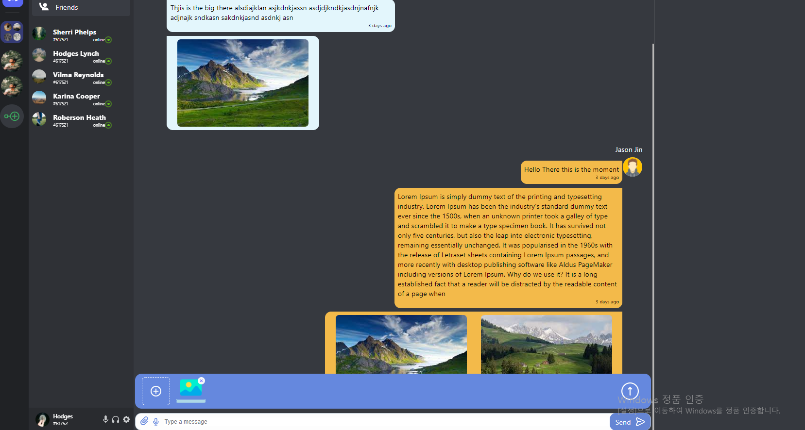

# This is Discord Clone Mock up 
Although design is a it rough and inconsistent with color scheme and sizes 
I am somewhat proud of the work

The stack I used
1. Firebase - firestroe and firebase auth and firebase function(for liseing to changes made to the firestore)

2. styled Component for making component 
(Now I realized that tailwind css is better for me. I will be using tailwind from now on)

3. React with create-react-app

4.typescript for type checking

Though this project I learned to make my own custom hooks auth and theme

If you want to pick up where I left off contact me through my email jinseok9338@gmail.com